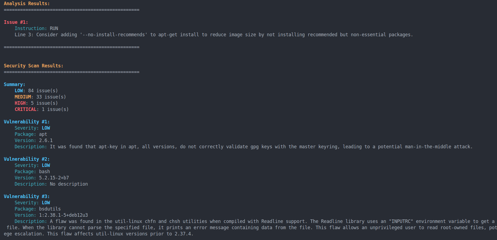

# 🐳 DClean

[](LICENSE)
[](https://semver.org)

⭐ If you find this project useful, please consider giving it a star to show your support!

## Table of Contents
- [Project Description](#description)
- [Installation](#installation)
- [Usage](#usage)
- [Project Structure](#project-structure)
- [Technologies](#technologies)
- [Authors](#authors)
- [Contributing](#contributing)


## Description

**DClean** is a powerful tool for analyzing Docker images and Dockerfiles.
DClean leverages **Trivy** for comprehensive vulnerability scanning and provides **actionable recommendations** to optimize your Dockerfile instructions, helping you create leaner, faster, and more secure containers.

## Installation
### Prerequisites
- Docker installed on your system
- Python 3.10 or higher
- pip (Python package manager)

### Option 1: Install from PyPI

```bash
pip install dclean
```

### Option 2: Install from Source

```bash
git clone https://github.com/mist941/dclean.git
```

```bash
cd dclean
```

```bash 
pip install -e .
```
### Verify Installation

```bash
dclean version
```
You should see the following output:
```bash
dclean version 0.1.0
```

## Usage

### Basic Commands

```bash
dclean version
```

### Analyze a Dockerfile:
```bash
dclean analyze path/to/Dockerfile
``` 
### Analysis Options

Save analysis results to a file:
```bash
dclean analyze path/to/Dockerfile --output path/to/output.txt
```
Perform deep analysis (includes vulnerability scanning):
```bash
dclean analyze path/to/Dockerfile --deep
```
### Examples

Deep analysis with colored output in terminal:
```bash
dclean analyze dockerfiles/Dockerfile --deep
```


Save results to a file:
```bash
dclean analyze dockerfiles/Dockerfile --deep --output examples/file_output.txt
```


## Project Structure


## Technologies


## Authors

## Contributing

🤝 Contributions are welcome! Feel free to open issues and submit pull requests.